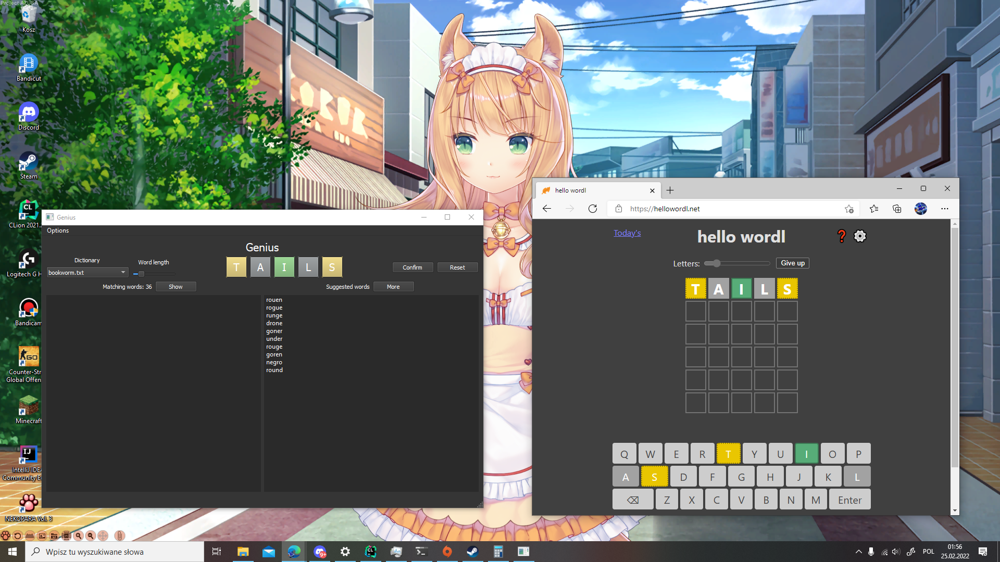
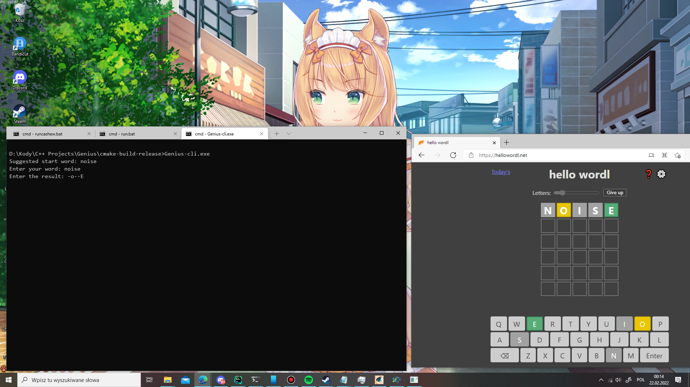

# Genius

Easy to use Wordle solving app made with Qt5

## Requirements:

* Windows: none since all files that this game needs to run are included
* Linux: Qt5, you can install it through the package manager

## Usage:

To launch Genius, execute the `Genius-(your system goes here)` executable, or if you want to use it in
console, `Genius-cli`.

To use Genius, you'll need a word list. The better the word list you choose, the better will the Genius work. You can
use [this one](https://github.com/dwyl/english-words/blob/master/words_alpha.txt) for example, but it contains a lot of
garbage words like 'aam' or 'abama' and many more that are not accepted, I used it because it's the longest reasonable
one. When you find one, rename it to `words.txt` and put it in the same directory as the executable. If you change
the `words.txt` file, you should also delete `wordCache.gen`, because the cache of the best starter words needs to be
created again.

### The GUI Version

___Attention: When using a dictionary for the first time, it'll lag when you change the word length because it needs to
create a cache of starter words for every word length that you play. After it finishes, it should be smooth.___

The GUI version has a nice interface which makes solving Wordle easy.
  
When you start Genius, it shows you suggested words to start with. To pick one of them, just click on it, and it'll
appear on the tiles. You can always enter your own word by just typing (if it doesn't work, click somewhere on the
buttons background). Next step is to enter the word into Wordle and highlight the letters with yellow or green,
depending on your Wordle's output. To mark a letter as yellow, left-click it, to mark a letter as green, right-click it.
Clicking it again will revert the color back to gray. When you entered the result, click "Confirm", and wait. After
several seconds the "Suggested words" list should be populated with new words, and the Matching words counter should
appear. You can repeat the process until you beat the game, and when you do, just press "Reset" to start again. If
you're playing hello wordl instead, you can change the word length by moving the Word Length slider, all lengths from 4
to 11 are supported. You can choose the dictionary you want to use by selecting it from the dropdown list under "
Dictionary".  
There is a settings and a help page, available settings are: default dictionary to load on startup and dark mode, turned
on by default.

### The Console Version

The console version might be a bit more complicated to use. When you launch it, you'll be greeted with a single
suggested word and a field to enter the word you entered into Wordle:
  
First, enter the word you entered into Wordle and press enter, and then enter the result. If a letter was marked with
gray, replace it with a dash, if it was marked yellow, put a lowercase version of it, and if it was marked green, put an
uppercase version of it, and hit enter. You'll be informed about the amount of matching words, and if you press enter,
you'll see them all, and then you'll be given an option to see suggested words to enter. The process is repeated until
you win. To start the console version with a different word length, put a number after the executable's name in the
command prompt (`Genius-cli.exe 11` for example). To stop it after the word was guessed, terminate it with Ctrl+C.

## Building

Both versions can be built with:

```shell
$ mkdir build
$ cd build
$ cmake ..
$ make
```

using the GNU compiler. Just remember that if you're on Windows, you need to specify the path to your Qt5 installation
in the CMakeLists.txt (the line is marked with a comment). You can build just one of the targets by specifying it (for
example `--target Genius-cli`)
